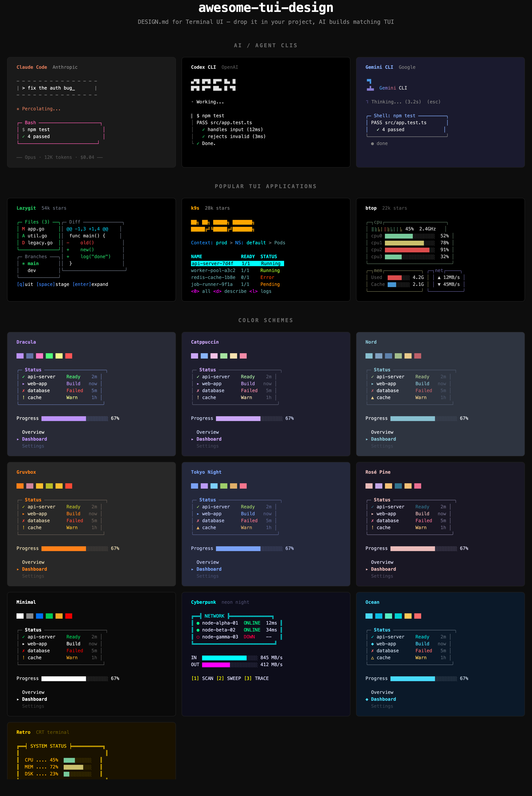

<br/>

<div align="center">
    <strong>Curated collection of DESIGN.md files for terminal UI — researched from real TUI source code.</strong>
    <br />
    <br />
</div>

<div align="center">


[](https://github.com/cola-runner/awesome-tui-design)


</div>

# Awesome TUI Design

Drop a `DESIGN.md` into your project, tell your AI agent "build me a terminal UI that looks like this" — and it just works.

Just like [awesome-design-md](https://github.com/VoltAgent/awesome-design-md) does for web UI, we do the same for **terminal UI**. No SDK, no dependencies — just Markdown that AI reads natively.

## How to Use

**1.** Pick a theme from the [list below](#themes) and download it into your project:

```bash
# e.g. claude-code — replace with any theme: lazygit, dracula, catppuccin...
curl -o DESIGN.md https://raw.githubusercontent.com/cola-runner/awesome-tui-design/master/designs/claude-code/DESIGN.md
```

**2.** Ask your AI agent:

```
Build me a terminal dashboard following the DESIGN.md in this project
```

Or clone the whole repo and let your agent pick a theme for you: `git clone https://github.com/cola-runner/awesome-tui-design.git`

## Themes

### AI & Agent CLIs

- [**Claude Code**](designs/claude-code/DESIGN.md) - Anthropic's coding agent. Warm terracotta `#D77757` accent, dashed ASCII input borders, hot pink `#FD5DB1` tool blocks, whimsical `· ✢ ✳ ✶ ✻ ✽` thinking spinner
- [**Codex CLI**](designs/codex/DESIGN.md) - OpenAI's coding agent. Monochrome adaptive, cosine-wave shimmer animation, `▌│└` gutter output, 10 variants of 36-frame ASCII startup art
- [**Gemini CLI**](designs/gemini-cli/DESIGN.md) - Google's AI assistant. 33fps gradient brand spinner, semantic border colors by tool state, 15+ built-in theme system with color tokens

### Popular TUI Applications

- [**Lazygit**](designs/lazygit/DESIGN.md) - Terminal git client (54k stars). Green bold active panel borders, multi-panel sidebar + diff layout, per-author commit graph colors, explosion easter egg
- [**k9s**](designs/k9s/DESIGN.md) - Kubernetes CLI manager (28k stars). Cool aqua/dodgerblue palette, orange ASCII art logo, black-on-aqua row selection, 7 semantic status colors
- [**btop**](designs/btop/DESIGN.md) - System resource monitor (22k stars). Braille dot-matrix graphs, green-yellow-red gradient meters, inverted `┐title┌` title brackets, 3 graph render modes

### Color Schemes

- [**Dracula**](designs/dracula/DESIGN.md) - Signature purple + pink on blue-gray, full Dracula palette, dev-focused
- [**Catppuccin**](designs/catppuccin/DESIGN.md) - Soothing pastels. Mauve primary, warm Mocha palette, rounded borders
- [**Nord**](designs/nord/DESIGN.md) - Arctic clean. Frost blue accents, structured single-line borders, Aurora status colors
- [**Gruvbox**](designs/gruvbox/DESIGN.md) - Retro groove. Orange on warm cream, earthy tones, vintage feel
- [**Tokyo Night**](designs/tokyo-night/DESIGN.md) - Urban night lights. Blue + purple on storm bg, teal for data paths
- [**Rosé Pine**](designs/rose-pine/DESIGN.md) - All natural. Warm pink accents on dark purple, dim muted borders
- [**Minimal**](designs/minimal/DESIGN.md) - Zero noise. Single-line borders, monochrome with blue accent
- [**Cyberpunk**](designs/cyberpunk/DESIGN.md) - Neon rain. Cyan + magenta on deep blue-black, dense panel tiling
- [**Ocean**](designs/ocean/DESIGN.md) - Deep sea calm. Rounded borders, soft blues and seafoam green
- [**Retro**](designs/retro/DESIGN.md) - CRT amber glow. Double-line borders, ALL CAPS headers, dot leaders

### Not just color palettes

Unlike web DESIGN.md files that extract CSS, our TUI themes are **researched from actual source code** — every hex value, every Unicode character, every animation frame is traceable to source.

## Request a DESIGN.md

[Open an issue](../../issues/new?template=theme-request.yml) to request a theme for any TUI application or color scheme.

## Create Your Own

```bash
mkdir designs/my-theme && cp TEMPLATE.md designs/my-theme/DESIGN.md
```

See [TEMPLATE.md](TEMPLATE.md) for the full template and [CONTRIBUTING.md](CONTRIBUTING.md) for guidelines.

## Preview Locally

```bash
python3 preview/preview.py --list                        # list all themes
python3 preview/preview.py designs/claude-code/DESIGN.md # preview one theme
python3 preview/gallery.py                               # generate HTML gallery
```

## License

MIT — see [LICENSE](LICENSE)
